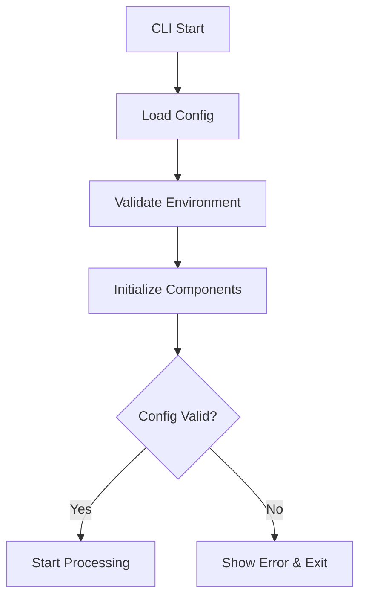

# AI Localization Tool - Architecture Documentation

> **Author:** Ahmet Enes Dur (ahmetenesdur@gmail.com)  
> **Version:** 1.2.0  
> **Last Updated:** 2025-10-14

## 📋 Table of Contents

1. [Overview](#overview)
2. [Architectural Principles](#architectural-principles)
3. [Layer Architecture](#layer-architecture)
4. [Data Flow](#data-flow)
5. [Performance Optimizations](#performance-optimizations)
6. [Security](#security)
7. [Extensibility](#extensibility)

---

## 🎯 Overview

AI Localization Tool is an enterprise-grade translation CLI tool developed for Next.js projects. It provides intelligent synchronization and context-aware translations using AI-powered translation services.

### Key Features

- **🤖 Multiple AI Provider Support**: OpenAI, Gemini, DeepSeek, Dashscope, XAI
- **🔄 Smart Synchronization**: SHA-256 hash-based change detection
- **🧠 Context Awareness**: Technical, DeFi, Marketing, Legal, UI categories
- **⚡ High Performance**: Cache, rate limiting, concurrent processing
- **✅ Quality Assurance**: Automatic validation and fixing
- **📊 Detailed Reporting**: Real-time progress and statistics

---

## 🏛️ Architectural Principles

### 1. Separation of Concerns

Each module has a single responsibility and can work independently from other modules.

### 2. Dependency Injection

Dependencies are injected through constructors, increasing testability.

### 3. Factory Pattern

Factory pattern is used for provider creation and management.

### 4. Strategy Pattern

Strategy pattern is applied for context detection and provider selection.

### 5. Single Responsibility Principle

Each class and function performs a single task.

### 6. Open/Closed Principle

New features can be added without modifying existing code.

---

## 📦 Layer Architecture

```
┌─────────────────────────────────────────────────────────┐
│                    CLI Layer (Entry)                     │
│                   bin/localize.js                        │
└─────────────────────┬───────────────────────────────────┘
                      │
┌─────────────────────▼───────────────────────────────────┐
│                 Command Layer (Commands)                 │
│              src/commands/translator.js                  │
│  • translateFile()  • processLanguage()  • fixFile()     │
└─────────────────────┬───────────────────────────────────┘
                      │
┌─────────────────────▼───────────────────────────────────┐
│                  Core Layer (Core)                       │
│  ┌────────────────┬──────────────────┬────────────────┐ │
│  │  Orchestrator  │ Provider Factory │ Context Proc.  │ │
│  │  • Coordination│ • Provider Mgmt. │ • Analysis     │ │
│  │  • Cache       │ • Fallback       │ • AI Detection │ │
│  │  • Rate Limit  │ • Validation     │ • Keywords     │ │
│  └────────────────┴──────────────────┴────────────────┘ │
└─────────────────────┬───────────────────────────────────┘
                      │
┌─────────────────────▼───────────────────────────────────┐
│              Provider Layer (Providers)                  │
│  ┌──────────┬──────────┬──────────┬──────────┬────────┐ │
│  │ OpenAI   │ Gemini   │ DeepSeek │Dashscope │  XAI   │ │
│  │ gpt-4o   │ 2.0-flash│  chat    │qwen-plus │ grok-4 │ │
│  └──────────┴──────────┴──────────┴──────────┴────────┘ │
│           All inherit from BaseProvider                  │
└─────────────────────┬───────────────────────────────────┘
                      │
┌─────────────────────▼───────────────────────────────────┐
│              Utilities Layer (Utilities)                 │
│  ┌──────────────────────────────────────────────────┐   │
│  │ Quality Checkers (Quality Control)               │   │
│  │ • PlaceholderChecker  • HtmlTagChecker           │   │
│  │ • PunctuationChecker  • LengthChecker            │   │
│  │ • TextSanitizer                                  │   │
│  └──────────────────────────────────────────────────┘   │
│  ┌──────────────────────────────────────────────────┐   │
│  │ File & State Management                          │   │
│  │ • FileManager   • StateManager                   │   │
│  │ • ObjectTransformer                              │   │
│  └──────────────────────────────────────────────────┘   │
│  ┌──────────────────────────────────────────────────┐   │
│  │ Performance & Monitoring                         │   │
│  │ • RateLimiter   • ProgressTracker                │   │
│  │ • RetryHelper   • GracefulShutdown               │   │
│  └──────────────────────────────────────────────────┘   │
└──────────────────────────────────────────────────────────┘
```

---

## 🔄 Data Flow

### 1. Startup Flow



### 2. Translation Process Flow

```
1. Source File Read
   ↓
2. State Analysis (Previous vs Current)
   ↓
3. Change Detection
   ├── New Keys → Queue for translation
   ├── Modified Keys → Queue for re-translation
   ├── Deleted Keys → Remove from targets
   └── Unchanged Keys → Skip
   ↓
4. Context Analysis (Batch Processing)
   ├── Keyword Matching (Fast)
   └── AI Analysis (Detailed, if needed)
   ↓
5. Translation (Parallel Languages)
   ├── Get Provider (with Fallback)
   ├── Check Cache
   ├── Apply Rate Limiting
   └── Execute Translation
   ↓
6. Quality Checks
   ├── Placeholder Validation
   ├── HTML Tag Preservation
   ├── Punctuation Check
   ├── Length Validation
   └── Auto-fix Issues
   ↓
7. Save Results (Atomic Write)
   ↓
8. Update State (SHA-256 Hash)
   ↓
9. Display Statistics
```

### 3. Provider Fallback Mechanism

```javascript
// Fallback Chain
Primary Provider (e.g., OpenAI)
    ↓ (fail)
Fallback #1 (e.g., Dashscope)
    ↓ (fail)
Fallback #2 (e.g., DeepSeek)
    ↓ (fail)
Fallback #3 (e.g., Gemini)
    ↓ (fail)
Fallback #4 (e.g., XAI)
    ↓ (fail)
Error: No providers available
```

---

## ⚡ Performance Optimizations

### 1. Caching Strategy

#### Translation Cache

```javascript
// LRU Cache with TTL
{
  max: 2000,           // Maximum 2000 translations
  ttl: 24h,            // 24 hour time-to-live
  updateAgeOnGet: true,// Update age on access
  allowStale: true     // Stale-while-revalidate
}
```

#### Context Result Cache

```javascript
// Separate cache for context results
{
  max: 1000,
  ttl: 24h,
  hashKey: SHA-256    // Collision-resistant
}
```

### 2. Rate Limiting

Provider-specific limits:

| Provider  | RPM  | Concurrency | Strategy |
| --------- | ---- | ----------- | -------- |
| OpenAI    | 1000 | 15          | FIFO     |
| Gemini    | 500  | 12          | FIFO     |
| XAI       | 300  | 10          | FIFO     |
| Dashscope | 200  | 8           | FIFO     |
| DeepSeek  | 200  | 8           | FIFO     |

### 3. Concurrent Processing

```javascript
// Multi-level parallelism:
1. Language Level: Parallel language processing (configurable)
2. Batch Level: Batch processing per language
3. Item Level: Concurrent translation within batch

// Example: 3 languages, 5 concurrency, 100 keys
// → 3 languages in parallel
//   → 20 batches per language (5 items each)
//     → 5 parallel translations per batch
```

### 4. Batch Optimization

```javascript
// Context analysis batching
- Keyword matching: O(n) across all text
- AI analysis: Batch request (reduced API calls)
- Cache lookup: Batch check

// Translation batching
- Chunk size: min(concurrencyLimit, maxBatchSize)
- Inter-batch delay: 50ms (minimized)
```

---

## 🔒 Security

### 1. Input Validation

```javascript
// All inputs are validated:
✓ Language codes (ISO 639-1)
✓ File paths (path traversal protection)
✓ Directory paths (sandboxed)
✓ API provider names (whitelist)
✓ Configuration values (type & range)
```

### 2. Safe File Operations

```javascript
// Atomic file operations:
1. Write to temporary file
2. Verify write success
3. Rename to target (atomic)
4. Cleanup on error

// Path sanitization:
- Resolve absolute paths
- Check within working directory
- Prevent "../" traversal
```

### 3. Sensitive Data Protection

```javascript
// Even in debug mode:
- API keys are masked
- File paths are sanitized
- Error messages are cleaned
- Logs are structured and safe
```

### 4. Error Boundary

```javascript
// Comprehensive error handling:
try {
	// Risky operation
} catch (error) {
	// Sanitize error message
	// Log safely
	// Graceful degradation
	// User-friendly message
}
```

---

## 🔧 Extensibility

### 1. Adding a New Provider

```javascript
// 1. Extend BaseProvider
class MyProvider extends BaseProvider {
  constructor(config) {
    super('myprovider', config);
  }

  getApiKey() {
    return process.env.MY_PROVIDER_API_KEY;
  }

  getEndpoint() {
    return 'https://api.myprovider.com/v1/translate';
  }

  async translate(text, sourceLang, targetLang, options) {
    // Implementation
  }
}

// 2. Add to provider-factory.js
const myProvider = require('./providers/my-provider');

const providers = {
  // ... existing
  myprovider: myProvider,
};

// 3. Add to config
apiConfig: {
  myprovider: {
    model: 'my-model',
    temperature: 0.3,
    maxTokens: 2000,
  }
}
```

### 2. Adding a New Quality Checker

```javascript
// 1. Extend BaseChecker
class MyChecker extends BaseChecker {
  check(sourceText, translatedText) {
    // Check logic
    return issues;
  }

  fix(sourceText, translatedText) {
    // Fix logic
    return { text, issues, fixes };
  }
}

// 2. Integrate in quality index.js
initializeCheckers() {
  // ... existing
  this.myChecker = new MyChecker();
}
```

### 3. Adding a New Context Category

```javascript
// Add to config:
context: {
  categories: {
    // ... existing
    medical: {
      keywords: ['diagnosis', 'treatment', 'patient', 'doctor'],
      prompt: 'Use precise medical terminology',
      weight: 1.5,
    }
  }
}
```

---

## 📊 Performance Metrics

### Benchmark Results (Example)

```
System: MacBook Pro M1, 16GB RAM
File: 500 keys, 13 languages
Settings: concurrency=5, cache=enabled

Results:
- Total Time: 52.4s
- Speed: 9.54 items/second
- Success Rate: 90%
- Cache Hit Rate: 45%
- Average Response Time: 1.2s
```

### Scalability

```
| Keys | Languages | Time (cache off) | Time (cache on) |
|------|-----------|------------------|-----------------|
| 100  | 5         | 12s              | 8s              |
| 500  | 13        | 85s              | 52s             |
| 1000 | 13        | 165s             | 98s             |
```

---

## 🛠️ Development Guide

### Debug Mode

```bash
# Detailed logging
localize --debug

# Verbose diagnostics
localize --verbose

# Both
localize --debug --verbose
```

### Profiling

```javascript
// Orchestrator stats
const status = orchestrator.getStatus();
console.log(status.cache); // Cache metrics
console.log(status.rateLimiter); // Rate limiter status
```

### Testing

```bash
# Local test
pnpm start

# Format check
pnpm format:check

# Format apply
pnpm format
```

---

## 📚 Resources

- [README.md](./README.md) - User guide
- [localize.config.js](./localize.config.js) - Configuration example
- [CONTRIBUTING.md](./CONTRIBUTING.md) - Contributing guide

---

## 📝 Notes

### Design Decisions

**Why LRU Cache?**

- O(1) get/set operations
- Automatic eviction
- TTL support
- Stale-while-revalidate pattern

**Why BaseProvider?**

- Code reuse
- Consistent interface
- Easy testing
- Simplified maintenance

**Why SHA-256 State Tracking?**

- Collision resistant
- Fast comparison
- Reliable change detection
- No false positives

**Why Batch Processing?**

- Reduced API calls
- Better throughput
- Cost optimization
- Network efficiency

---

## 🔮 Future Improvements

### Planned Features

1. **WebSocket Support**: Real-time progress updates
2. **Distributed Processing**: Multi-machine support
3. **Machine Learning**: Custom translation models
4. **Plugin System**: Third-party extensions
5. **Web UI**: Visual configuration and monitoring
6. **A/B Testing**: Translation quality comparison
7. **Cost Tracking**: API usage analytics
8. **Team Collaboration**: Shared configurations

---

**Author:** Ahmet Enes Dur  
**Email:** ahmetenesdur@gmail.com  
**License:** ISC
